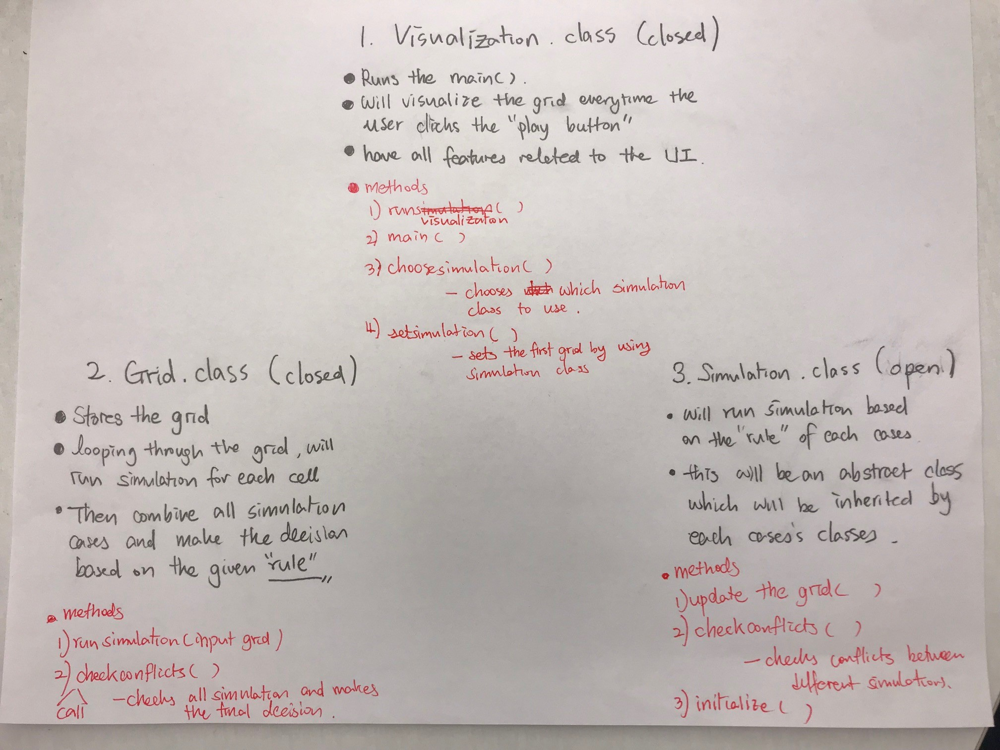
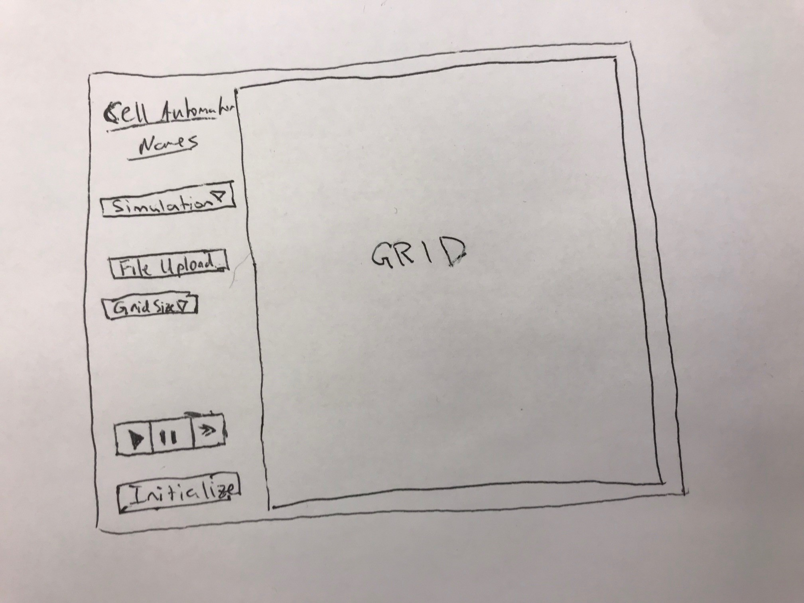

# Cell Society Plan
### Louis Jensen, Louis Lee, Justin Kim

#### Introduction
We will be creating a program that can run many types of two
 dimensional cellular automata simulations. The grid size 
 and type of simulation will be variable and the program 
 will need to be able to run every possibility. Each cell 
 in the grid will maintain its state and all the cells will 
 update their state “simultaneously” based on their 
 neighboring cells. The simulation will be open because 
 it will need to have several options and be able to be 
 updated if more simulations are added to the list of 
 possibilities. All the other primary parts of the program 
 will be closed. 
 
#### Overview

#### User Interface

#### Design Details
For visualization.class, we can use javafx. Input will 
be click buttons. 

Methods: main(), visualize(), runsimulation(), setsimulation()

For the Grid.class, we can use 2d array to store 
information about the current state. 
Grid class will have two grids. One with the “actual info”
and the other with possible states(The 2nd grid will 
have lists as elements). This way, when we go through 
simulation, we can first loop through the whole grid 
and store possible states in the 2nd grid as a list 
form. Then checkConflicts in Simulation class method
 ill determine which cells will be moved. 
	
Simulation class will be an abstract class. We will 
create individual classes for each cases. 

Methods: updatethegrid(), checkconflicts(), initialize(), 
        Checkconflicts() : this method will be overriden in each simulation classes.  The rest methods will be inherited. 

Use Cases
1. To update any cell, you use the states of all the cells 
around it that exists. If it is an edge cell use only 
those cells that border it. 
2. To switch simulations there will be a drop down 
menu of possible simulations, when one is clicked it 
will reset the grid to create that simulation and display 
an initial configuration.
3. To move to the next generation loop through all the 
cells updating their next grid based on the neighboring 
cells in current grid. After the whole next grid has been 
filled, get the first element of each list and set it 
to its corresponding position in current grid. Then clear 
the lists in next grid and display the current grid.
4. A simulation parameter, such as probCatch for the 
fire simulation will be set by loading the file of info 
and sending it to the class of that specific simulation. 
That simulation will know the rules to establish the 
probCatch value.

#### Design Considerations
We decided to make two 2d arrays for the grid. One will be
the ‘actual’ grid, and the other will contain possibilities 
of the next state. So the second grid will store the 
information about possible states using the list as 
entries. We first thought of making two grids both having 
‘cells’ as entries but realized this would not be able 
to reflect some cases where there exists multiple states 
for each cells. Because we have lists of possible states,
we would have to make a separate method checkConflicts() 
that will determine the final state among the list of 
possible states. 

Because we would have to read in initial configuration, 
we decided to have initialize() method in each simulation 
class and have mysimulation as a public variable in the 
visualization class. 

#### Team Responsibilities 
Louis Lee - Primary: create a template for the whole 
project, Secondary: write visualization class. 

Louis Jensen - Primary: write Grid class. Secondary: 
write visualization class.

Justin Kim - Primary: write abstract simulation 
class, Secondary: write visualization class 

After finishing this, we will each start writing simulation class for each cases(One for each) 
Then whoever finishes first will work on one more simulation class and the others will start integration. 
